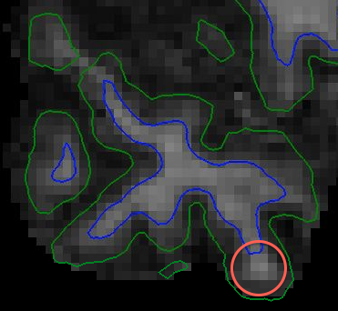

======================
Surface reconstruction
======================

Surfaces
--------

Most of our analyses are performed on data that have been mapped to the
cortical surface. Surface-based data files come in mainly two kinds: anatomical
surfaces, and metric overlays. Anatomical surfaces are like high-res T1 images.
They are used to represent the shape of the cortical sheet, all of the sulci
and gyri. Anatomical surfaces are geometrical structures made up of triangular
faces that are "glued" together along the edges to form a closed "mesh". The
points of the triangular faces are called vertices. Vertices are the surface
analogues to voxels. They are the units of analysis.

.. figure:: images/surf_mesh_01.pdf

   Renderings of an anatomical surface. **(A)** The entire surface shown from
   the medial view. V1 is boxed. **(B)** A close-up of V1, with vertices shown
   in teal. **(C)** Another close-up of V1, this time showing the mesh structure.

Metric overlays, on the other hand, are more like BOLD images. Metrics store
the actual functional data. At bottom, metrics are mappings between the
vertices of an anatomical surface and some numerical data. The numerical data
assigned to each vertex can either be a vector, like a functional time series,
or a single scalar, such as a *z* or *t* value. Metrics are also commonly used
to represent ROIs, by assigning vertices within the ROI the value 1, and all
other vertices 0. One important thing to remember is that metrics contain no
anatomical structure. This is unlike standard BOLD images, where the spatial
relationships between data points are encoded in the file format itself.

.. figure:: images/metrics_01.pdf

  Examples of metric overlays. **(A)** An ROI in inferior frontal cortex,
  represented with 1's and 0's. **(B)** A *z*-stat image for a language contrast.

Introduction to Freesurfer
--------------------------

All of our surface-based analyses depend a lot on the Freesurfer software
package. Freesurfer is basically a set of command-line tools for generating and
manipulating surface files. Generating anatomical surfaces from T1 images is
probably the most important thing we use Freesurfer for. The command for that
is called ``recon-all``. Some other important uses for Freesurfer include:

- Volume and surface visualization (freeview_, tksurfer_)
- Volume and surface file conversion (``mri_convert``, ``mris_convert``)
- Surface-informed volume registration (``bbregister``)
- Surface manipulation (``mri_surf2surf``)
- Surface-based group fMRI statsistics (``mri_glmfit``)

Freesurfer uses a centralized workspace called the *Subjects Directory* for
carrying out most of its processing. The location of the Subjects Directory is
determined by the shell environment variable ``SUBJECTS_DIR``. Within the
Subjects Directory there are going to be many individual *subject folders*.
These folders are generated when you run ``recon-all``. Their purpose is to
store all of the output surface files and intermediate volume files created by
``recon-all``. For example, the default Freesurfer Subjects Directory
(``$FREESURFER_HOME/subjects``), contains a subject called "bert"::
  
  bert/
    |- bem/
    |- label/
    |- mri/
      |- brain.mgz
      |- orig.mgz
      |- T1.mgz
    |- scripts/
      |- recon-all.log
      |- recon-all-status.log
    |- src/
    |- stats/
    |- surf/
      |- lh.pial
      |- rh.pial
      |- lh.sphere.reg
      |- rh.sphere.reg
      |- lh.white
      |- rh.white
    |- tmp/
    |- touch/
    |- trash/

The mri and surf folders contain the output volume and surface files
respectively. For example, T1.mgz is a copy of the raw T1 volume, after
intensity bias correction has been applied. lh.white is an anatomical
surface that follows the grey/white matter boundary in the left hemisphere.

.. note:: Freesurfer uses a custom file format to represent MRI volumes and
   surfaces. These files usually have the extension ``.mgh`` or ``.mgz``
   (compressed). You can convert these files to more standard formats
   like Nifti and Gifti using ``mri_convert`` and ``mris_convert``
   respectively.

A good way to get familiar with all of the Freesurfer output files is by
following the `Freesurfer output inspection tutorial`_, either with the
tutorial data or your own. This is also a good way to get familiar with the
primary Freesurfer visualization tool, freeview_.

When you open a new terminal, ``SUBJECTS_DIR`` will probably be set to
``$NPDL_SCRIPT_DIR/subjects``. This is a lab-specific folder that contains the
three *group average* subjects we use most often: fsaverage, 32k_fs_LR, and
164k_fs_LR. fsaverage comes packaged with Freesurfer and is based on the MNI
305 template. 164k_fs_LR and 32k_fs_LR are derived from it. It is useful to
have the ``SUBJECTS_DIR`` set this way, so you can have easy access to these
subject folders. However, when it is time for you to do your own analyses, you
will need to create a Subjects Directory inside your analysis folder to hold
the surface reconstruction folders for your study subjects.

Additional Freesurfer resources
~~~~~~~~~~~~~~~~~~~~~~~~~~~~~~~

- The Freesurfer course materials: https://surfer.nmr.mgh.harvard.edu/fswiki/FsTutorial
- The Freesurfer youtube channel: https://www.youtube.com/channel/UCruQerP8aa-gYttXkAcyveA
  
  - In particular, the smoothing and registration talk, which is all about the
    benefits of surface-based analysis: https://www.youtube.com/watch?v=8WPvXoORoAw

.. _freeview: http://freesurfer.net/fswiki/FreeviewGuide
.. _tksurfer: https://surfer.nmr.mgh.harvard.edu/fswiki/tksurfer
.. _Freesurfer output inspection tutorial: http://freesurfer.net/fswiki/FsTutorial/OutputData_freeview

Running ``recon-all``
---------------------

Freesurfer's entire surface reconstruction pipeline is completely automated. It
only takes one command to get the process going, e.g.:

.. code-block:: sh

   recon-all -subject BLAH_S_01 -i T1.nii.gz -all

This command will create a subject folder called BLAH_S_01 inside the Subjects
Directory and begin populating it with BLAH_S_01's anatomical surfaces. The
only input is T1.nii.gz, the high resolution T1 volume. There are about 34
steps in the entire processing stream, starting with intensity normalization
and skull stripping, and going through surface creation, surface inflation, and
surface-based registration to fsaverage. Altogether it can take up to 10 hours
to complete (on our machine it's usually about 6 hours). The ``-all`` option
tells recon-all to do all 34 steps. 

You can view the complete description of all processing steps either by looking
at the ``recon-all`` help message, or by navigating to the online `Freesurfer
analysis pipeline overview`_. If you're looking for more detail, try the
`recon-all table`_ which contains a complete outline of all the reconstruction
steps, and the sub-commands involved. 

.. note:: Make sure to set the ``SUBJECTS_DIR`` environment variable properly
   before you start your analyses. Otherwise ``recon-all`` will try to write to
   the default Subjects Directory, which will likely cause a permissions error.

.. _Freesurfer analysis pipeline overview: http://freesurfer.net/fswiki/FreeSurferAnalysisPipelineOverview
.. _recon-all table: http://freesurfer.net/fswiki/ReconAllTableStableV5.3

Inspecting outputs
------------------

The critical outputs of the Freesurfer reconstruction process are four surfaces
(two for each hemisphere). The left and right "white" surfaces mark the
grey/white matter boundary. The left and right "pial" surfaces mark the
CSF/grey matter boundary. The goal of data inspection is to check that the
volume between these surfaces includes all and only grey matter.

We visually inspect these surfaces overlaid onto the high-res anatomical image.
To do this, we load the surfaces and the high-res anatomical into the
Freesurfer viewer, freeview_. Freeview can be opened at the terminal by typing
``freeview``. You can then use the GUI interface to load the surfaces and T1
image.

Alternatively, you can specify the images as command-line arguments to the
``freeview`` command.

To make loading images easier, we have the command ``checksurf``, which only
requires a subject ID argument (provided the ``SUBJECTS_DIR`` is set properly):

.. code-block:: sh
   
   checksurf $subj

All ``checksurf`` does is encapsulate what would be a very long ``freeview``
call: loading the original T1, the brain-extracted T1, the left and right white
and pial surfaces, as well as the left and right inflated surfaces

.. code-block:: sh

   freeview \
     -v \
     $SUBJECTS_DIR/$subj/mri/brainmask.mgz \
     $SUBJECTS_DIR/$subj/mri/orig.mgz:visible=0 \
     -f \
     $SUBJECTS_DIR/$subj/surf/lh.white:edgecolor=blue:edgethickness=2 \
     $SUBJECTS_DIR/$subj/surf/rh.white:edgecolor=blue:edgethickness=2 \
     $SUBJECTS_DIR/$subj/surf/lh.pial:edgecolor=green:edgethickness=2 \
     $SUBJECTS_DIR/$subj/surf/rh.pial:edgecolor=green:edgethickness=2 \
     $SUBJECTS_DIR/$subj/surf/lh.inflated:edgethickness=0:visible=0 \
     $SUBJECTS_DIR/$subj/surf/rh.inflated:edgethickness=0:visible=0

To check the surface boundaries, you will want to scroll through each slice of
the image, looking for places where too much or too little has been included as
"grey matter". You should pick either the sagittal, coronal, or axial view from
the top menu bar, and work your way through the entire image. You can scroll
the slices using "Fn+Up Arrow" and "Fn+Down Arrow". Some other useful shortcuts
are:

- Shift+Left click drag: Control brightness/contrast of the anatomical image
- Mouse scroll: Zoom in/out
- Ctrl+Left click: Zoom in at cursor
- Ctrl+Right click: Zoom out at cursor
- Left/Right/Up/Down Arrow: Move FOV

These shortcuts and others can also be found in Help --> Quick Reference in
the Freeview window.

Some general pointers for checking surface accuracy:

- About 1-3 seconds per slice tends to be a good pace.
- I prefer to holistically watch the entire cortex as I scroll through, rather
  than fixate on each individual sulcus and gyrus.
- When you see something that doesn't look right, try clicking on the spot and
  changing views. Getting a different perspective usually helps you decide if
  what you're seeing is really an error.
- It also helps to pass over a problem area a few times, scrolling back and
  forth. Getting a better idea of the context around a potential reconstruction
  error will usually help you decide what to do about it.

.. _freeview: http://freesurfer.net/fswiki/FreeviewGuide

Common reconstruction errors
----------------------------

Most of the time the surfaces produced by Freesurfer are just fine and don't
need any intervention (say ~50% of subjects). When there are surface
problems, they'll usually fall into one of the following categories.

.. note:: Many of these errors are covered in the `Freesurfer failure modes
   talk <http://surfer.nmr.mgh.harvard.edu/pub/docs/freesurfer_failuremodes_ani.ppt>`_,
   and the fixes are described in the `Freesurfer troubleshooting tutorial
   <https://surfer.nmr.mgh.harvard.edu/fswiki/FsTutorial/TroubleshootingData>`_.
   **When unsure, defer!** Freesurfer is smart, and objective. If you're
   not sure that what you're seeing is an error, just let it be.

Bad white matter segmentation
~~~~~~~~~~~~~~~~~~~~~~~~~~~~~

The segmentation of white matter from grey matter relies on white matter voxels
having a consistent intensity. When you get a region of white matter that is
especially bright or dark, this can cause Freesurfer to mislabel it. You'll
often see this problem in the long, thin gyri located in anterior temporal
lobe.

To fix this kind of error, you'll need to place some *control points* on or
around the mislabeled voxels, and re-run ``recon-all``. For a full description
of the steps to take, see the `Freesurfer control points tutorial`_.

.. note:: This type of error is often visible in several adjacent slices. If
   you see what looks like a white matter segmentation error in one isolated
   slice, you should probably leave it be. This is most likely just Freesurfer
   making a difficult partial-volume decision.

   
   Example of bad white matter segmentation. A cluster of white matter voxels
   are classified as grey matter. It is difficult to see here, but the circled
   white matter voxels have intensity values well below the expected value,
   110.

Skull segmented as grey matter
~~~~~~~~~~~~~~~~~~~~~~~~~~~~~~

The skull stripping step can sometimes fail to remove parts of the skull or
dura, especially around the eyes, around orbitofrontal cortex, and near the top
of the head. This extra skull can sometimes get mislabeled as grey matter,
which you'll have to fix by erasing the voxels manually. For a full description
of the steps to take, see the `Freesurfer skull-strip fix tutorial`_.

.. note:: Most of the time skull strip errors won't cause surface errors. No
   need to do anything in this case. The surfaces are all we care about.

.. figure:: images/skullstrip_nofix.png
   :scale: 40 %

   Skull strip errors that don't affect the cortical surface.

White Matter Lesions
~~~~~~~~~~~~~~~~~~~~

We sometimes see subjects with small lesions scattered in their white matter.
These lesions look like dark spots in the white matter volume. They are more
common in older subjects, and usually having one means having many. When these
lesions occur near the grey/white matter boundary, they can cause the white
surface to errantly "dip" into (what should be) white matter.

Adding control points won't help in this situation. You can only use control
points to correct intensity issues due to scanner bias. Putting a control point
on a voxel tells Freesurfer "This voxel is white matter, so you should scale
it's intensity (and that of neighboring voxels) to match other white matter
voxels." Since lesion voxels don't actually contain white matter, adding
control points here is the wrong choice. Instead, you will have to manually
fill in the lesion area in the subject's wm.mgz volume. For complete
instructions, see the `Freesurfer white-matter edit tutorial`_.

.. figure:: images/wmlesion1.png
   :scale: 40 %
 
   A white matter lesion causing a reconstruction error. **(A)** The error shown
   on the brainmask.mgz volume. **(B)** The error shown on the wm.mgz volume. Note
   how implausible the surface curvature is here. Also, see that the error is
   more obvious in **(B)** than in **(A)**. 
  
Midline weirdness
~~~~~~~~~~~~~~~~~

The paths that the surfaces take through the midline structures and the corpus
callosum are usually pretty nonsensical. **This is to be expected.** Don't
worry about it. The lines here are more or less arbitrary, since there is no
cortex to follow.

.. figure:: images/midline_surf_inacc_02.pdf
   :scale: 40 %

   Uninterpretable pial surface through midline subcortical structures.

.. _Freesurfer control points tutorial: https://surfer.nmr.mgh.harvard.edu/fswiki/FsTutorial/ControlPoints_freeview
.. _Freesurfer skull-strip fix tutorial: https://surfer.nmr.mgh.harvard.edu/fswiki/FsTutorial/SkullStripFix_freeview
.. _Freesurfer white-matter edit tutorial: https://surfer.nmr.mgh.harvard.edu/fswiki/FsTutorial/WhiteMatterEdits_freeview

Quality control record keeping
------------------------------

It's very important to take notes while inspecting your data. This way you can
return months later and feel confident that the quality assurance was done
right. As a lab, we try to stick to a common format for quality control record
keeping.

The quality control spreadsheet, usually called *recon_QC.xls* has two tabs.
The first tab, called *Recon check*, is for keeping track of who checked which
subjects when, and whether the reconstruction was ok, or required fixing.

===========  ========  ======== ==========
  Subject    Recon OK   Date    Checked by
===========  ========  ======== ==========
BSYN_CB_02     yes     8/4/15   CL
BSYN_S_02      no      8/4/15   CL
===========  ========  ======== ==========

The second tab, called *Recon errors*, is for keeping track of errors that you
find in the surface reconstruction. Each row corresponds to an error. In the
columns, you record the subject that you found the error in, a description of
the error, the voxel coordinates for the error, what fix you applied (if any)
and whether the fix worked. Keep in mind that this sheet is both for errors
that need intervention, and for problem spots you just want to note, but don't
need any further action. If you're not sure how to describe an error you see,
or how to fix it, you should still take down at least the voxel coordinates.
This way you can return to it later.

===========  ======================================= =============== ==================== ======
  Subject                                Error       Coordinates       Fix                Fixed
===========  ======================================= =============== ==================== ======
BSYN_CB_02   Questionable partial-volume decision    [87, 153, 87]   N/A                  N/A
BSYN_S_02    Skull included around right eye         [154, 144, 175] N/A                  N/A
BSYN_S_02    Skull included in right orbital frontal [160, 151, 156] Removed extra skull  yes
===========  ======================================= =============== ==================== ======

Post reconstruction processing
------------------------------

After Freesurfer reconstruction is complete, some additional surface processing
is required before you can move on to later analysis steps. These steps are
carried out using the ``postrecon`` script, and include:

- Nonlinear registration of the subject's T1.mgz with the MNI 152 template
  using FSL's ``fsl_anat``.
- Converting primary surfaces to Gifti format using ``mris_convert``.
- Constructing HCP-style midthickness and inflated surfaces using ``wb_command
  -surface-average`` and ``wb_command -surface-generate-inflated``.
- Downsampleing Gifti surfaces to the 32k_fs_LR mesh using ``wb_command
  -surface-resample``. This reduces number of vertices from >100K to ~32K.
  After downsampling, each surface face occupies ~2mm\ :sup:`2`\ , which more
  closely follows the resolution of the raw data.

``postrecon`` only requires a subject ID argument:

.. code-block:: sh

   postrecon $subj

Subject folders are modified in place. The results of the volumetric
registration are written to mri/T1. The generated surfaces are added to the
surf folder.
